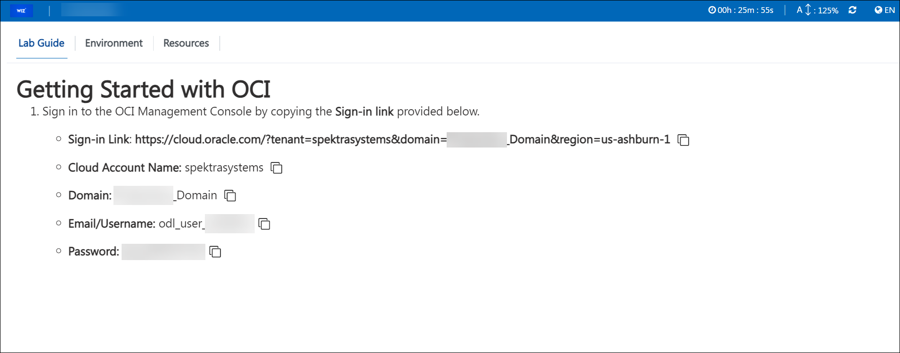

# OCI User Details Using Inject Keys
## Feature Requirement

This feature dynamically displays OCI account details, such as email, username, password, domain name, and more, on the Getting Started page by leveraging inject keys in the markdown file. These details are rendered automatically for each user, enhancing efficiency and consistency in lab setup. 

## Implementation

To implement this feature, follow the code snippets below. Replace placeholders with corresponding inject keys to ensure the values are dynamically populated.

### **Inject Key Code Snippets**

1. **Sign-In Link:**  
   ```markdown
   <inject key="ocisigninurl" enableCopy="true" />
   ```

2. **Cloud Account Name:**  
   ```markdown
   <inject key="tenantdomainname"></inject>
   ```

3. **Domain:**  
   ```markdown
   <inject key="aaddomain"></inject>
   ```

4. **Email/Username:**  
   ```markdown
   <inject key="AzureAdUserEmail"></inject>
   ```

5. **Password:**  
   ```markdown
   <inject key="AzureAdUserPassword"></inject>
   ```

### Example Output
The above inject keys will render a Getting Started section with dynamically populated user-specific details. Below is an example image of the output:

*(Refer to the attached sample image for how it will appear.)*


