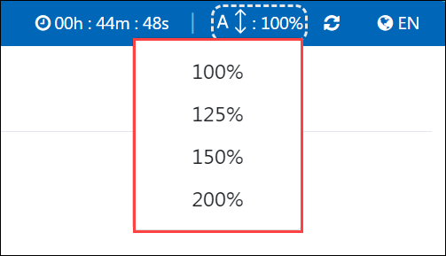

# Environment Page Font Size Adjustment Feature
## Feature Requirement

This feature allows users to easily increase or decrease the size of the font on the Environment Page using a dedicated button.

## Steps to Use the Feature

### Step 1: Navigate to the User Environment Page

1. Add a new user by clicking the "Add User" button (highlighted as the first option).

1. Click on the Environment Icon (highlighted as the second option) to open the User Environment Page.

### Step 2: Access the Size Adjustment Option
1. On the Environment Page, find the Font Size Adjustment button represented by the **"A ↕ 100%"** icon in the top navigation bar (see the below image).

### Step 3: Adjust the Font Size
1. Click on the **Font Size Adjustment** button to open a dropdown menu.

1. Choose your desired font size from the available options:
    - 100% (default)
    - 125% 
    - 150%
    - 200%
1. The font size on the page will immediately change to match your selection.

## Key Notes

- The font size changes dynamically, making it easier to read content on the page.
- To reset the font size to the default, select 100% from the dropdown.
- This feature does not affect the layout or other page elements; only the font size is modified.
