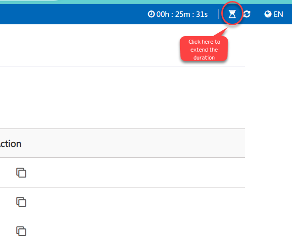

# Extension of Duration Based on Hours and Days

### Overview

Attendees will be able to extend the duration of their lab in increments of Minutes, Hours, and Days.

### Prerequisites

Before enabling and configuring the duration extension feature in ODL, ensure you meet the following prerequisite:

- Admin access to the [CloudLabs Admin Portal](https://admin.cloudlabs.ai/) (If access is unavailable, please reach out to your point of contact or [CloudLabs Support](https://docs.cloudlabs.ai/RequestSupport)).

### Enabling the Duration Extension Feature in ODL

1. Log in to the CL portal and navigate to the required tenant (WIZ). On the left-hand side of the page, go to the **On Demand Labs** section.

2. In the left menu, go to **ODL (1)** and click on the **edit (2)** button.

   

3. Scroll down to the **Allow User to Extend Lab** section and enable the checkbox.

   

4. Select the required duration parameters from the dropdowns for **Max Limit of Duration Extension by User** and **Allowed Extend Duration By Attendee** with appropriate values.

   

---

**Note:** The Max Limit should be an exact multiple of the Allowed Extend Duration to ensure that any extensions granted follow a consistent, repeatable pattern without remainder.

### Example Calculation

Suppose we set the following:

1. **Max Limit of Duration Extension by User** = 180 minutes
2. **Allowed Extend Duration By Attendee** = 30 minutes

For the setting to be valid, the **Max Limit (180 minutes)** should be evenly divisible by the **Allowed Extension (30 minutes)**. Here’s how we calculate it:

   

Since 6 is a whole number, 180 is a multiple of 30, so this configuration is **valid**.

---

### Example of an Invalid Configuration

Now, let’s try with:

1. **Max Limit of Duration Extension by User** = 175 minutes
2. **Allowed Extend Duration By Attendee** = 30 minutes

   

Since 5.83 is not a whole number, 175 is **not** a multiple of 30, making this configuration **invalid**.

---

5. Finally, click on the **Submit** button.

   

6. To extend the duration of the lab, click on the highlighted icon located at the **top right corner of the page.** 

   

7. After clicking on the icon, a confirmation pop-up will appear. Click OK to confirm the action.

   

8. Finally, a confirmation message will display on the page, and a notification will be sent to your instructor.

   
